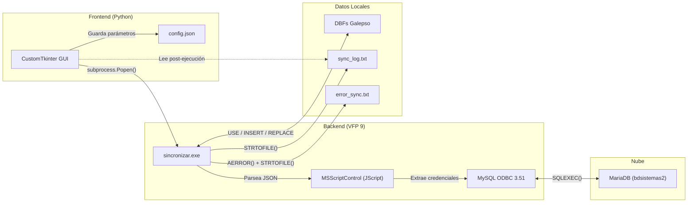
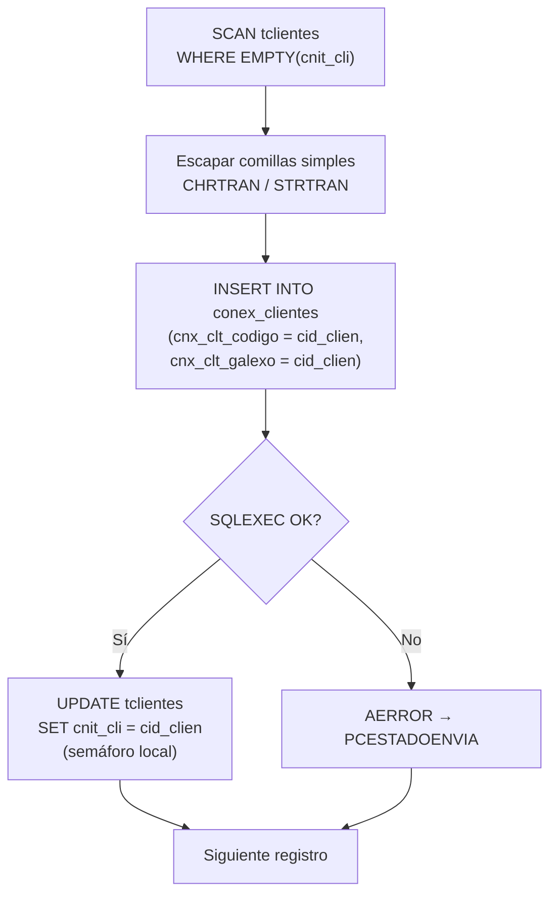
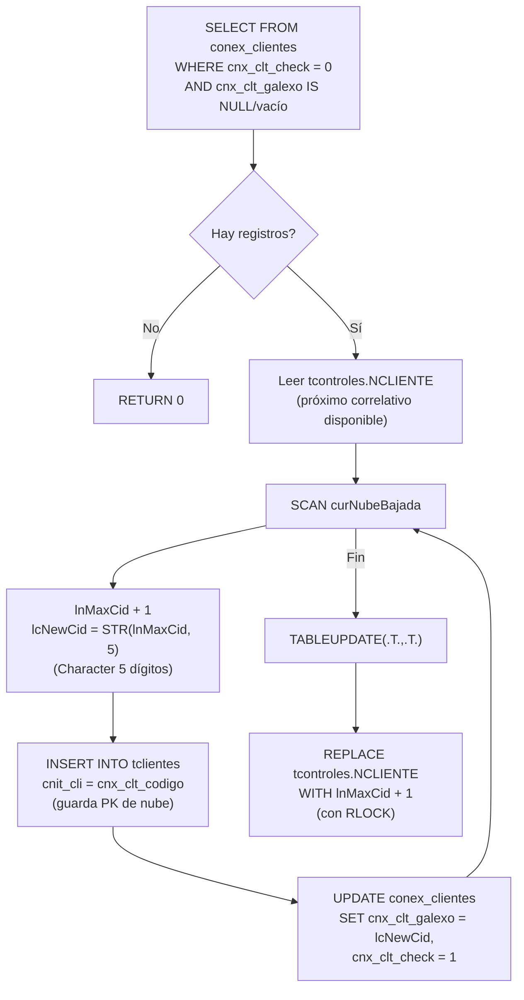
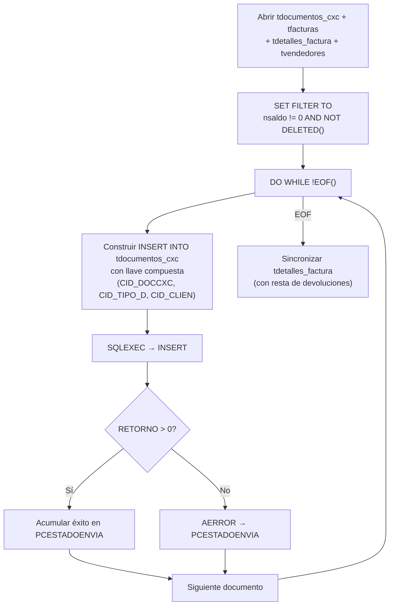
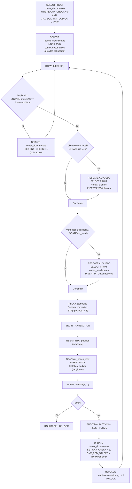
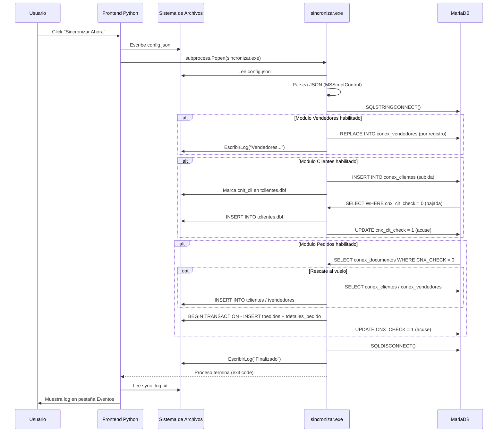

# WORKFLOW.md — Guía Oficial del Sincronizador

> **Versión:** 1.0  
> **Última actualización:** 2026-09-22  
> **Alcance:** Arquitectura completa, orquestación y flujos transaccionales del Sincronizador Galepso (VFP 9 ↔ MariaDB)

---

## Tabla de Contenidos

1. [Arquitectura Base y Orquestación](#1-arquitectura-base-y-orquestación)
   - [1.1 Frontend (Python)](#11-frontend-python--customtkinter)
   - [1.2 Backend (Visual FoxPro)](#12-backend-visual-foxpro--sincronizarexe)
   - [1.3 Contrato de Datos (config.json)](#13-contrato-de-datos--configjson)
   - [1.4 Telemetría y Logs](#14-telemetría-y-logs)
2. [Flujos por Módulos Transaccionales](#2-flujos-por-módulos-transaccionales)
   - [2.1 Clientes y Vendedores (Bidireccional)](#21-clientes-y-vendedores-bidireccional)
   - [2.2 Cuentas por Cobrar — CxC (Subida Quirúrgica)](#22-cuentas-por-cobrar--cxc-subida-quirúrgica)
   - [2.3 Pedidos (Bajada con Rescate)](#23-pedidos-bajada-con-rescate)
3. [Catálogos Maestros (Patrón SyncUpsert)](#3-catálogos-maestros-patrón-syncupsert)
4. [Diagrama de Secuencia Global](#4-diagrama-de-secuencia-global)

---

## 1. Arquitectura Base y Orquestación

El sistema opera bajo una arquitectura **split-process**: un frontend gráfico en Python controla la configuración y la cadencia; un backend compilado en Visual FoxPro ejecuta la lógica de sincronización contra MariaDB. Ambos procesos se comunican exclusivamente a través del sistema de archivos.



---

### 1.1 Frontend (Python) — CustomTkinter

| Aspecto | Detalle |
|---|---|
| **Archivo** | [`main.py`](file:///c:/GalepsoSync/main.py) |
| **Framework** | CustomTkinter (tema `blue`, modo `System`) |
| **Clase principal** | `GalepsoSyncApp(ctk.CTk)` |

**Responsabilidades:**

- **Consolidación de parámetros:** Credenciales de BD (servidor, puerto, usuario, contraseña, base de datos), ruta local de datos, código de empresa, intervalo de sincronización, y módulos activos.
- **Persistencia:** Serializa toda la configuración en [`config.json`](file:///c:/GalepsoSync/config.json) mediante `json.dump()` antes de cada ejecución del backend.
- **Prueba de conexión:** Intenta conectar vía `pyodbc` (fallback a `pymysql`) en un hilo separado, con detección automática de DSN vs. parámetros directos.
- **Ejecución del backend:** Lanza `dist/sincronizar.exe` como subproceso (`subprocess.Popen`) con `CREATE_NO_WINDOW`. El hilo del frontend queda bloqueado en `process.wait()` mientras la UI principal sigue respondiendo.
- **Modos de ejecución:**
  - **Manual:** Botón *"Sincronizar Ahora"* → ejecución única.
  - **Automático:** Botón *"Iniciar Automático"* → bucle temporizado con espera interrumpible cada segundo.
- **Log visual:** Pestaña *"Eventos (Log)"* con `CTkTextbox` estilo terminal (Consolas 12pt, fondo `#1E1E1E`, texto `#00FF66`). Lee `sync_log.txt` tras cada ejecución del backend.

---

### 1.2 Backend (Visual FoxPro) — `sincronizar.exe`

| Aspecto | Detalle |
|---|---|
| **Archivo fuente** | [`sincronizar.prg`](file:///c:/GalepsoSync/sincronizar.prg) |
| **Ejecutable** | `dist/sincronizar.exe` (compilado VFP 9) |
| **Modo** | Headless (`_SCREEN.Visible = .F.`, `SYS(2335, 0)`) |

**Flujo de ejecución:**

```
1. Leer config.json del directorio de trabajo
2. Sanitizar BOM UTF-8 + saltos de línea + tabulaciones
3. Parsear JSON via MSScriptControl.ScriptControl (JScript)
   → var config = ({...json...});
   → Extraer: config.database.*, config.modules.*
4. Construir string de conexión ODBC
   → DRIVER={MySQL ODBC 3.51 Driver};SERVER=...;PORT=...;...
5. SQLSETPROP(0, "DispLogin", 3) + SQLSTRINGCONNECT()
6. Ejecutar módulos habilitados condicionalmente
   → IF llSyncVend → DO SyncVendedores
   → IF llSyncCli  → DO SyncClientes
7. SQLDISCONNECT() + QUIT
```

**Manejo de errores:** `ON ERROR DO ManejadorErrores` captura errores críticos no controlados, los escribe en `error_sync.txt`, cierra conexiones y termina la aplicación.

---

### 1.3 Contrato de Datos — `config.json`

El JSON actúa como contrato de interfaz entre los dos procesos. Estructura canónica:

```json
{
    "database": {
        "server": "159.195.66.171",
        "port": "3459",
        "user": "galexo_kw",
        "password": "***",
        "database": "bdsistemas2"
    },
    "settings": {
        "save_credentials": true,
        "local_path": "X:\\Galepso\\Data\\Emp6\\",
        "id_enterprise": "1",
        "interval_min": "10"
    },
    "modules": {
        "clientes": true,
        "productos": false,
        "pedidos": true,
        "cxc": false,
        "vendedores": true
    }
}
```

> [!IMPORTANT]
> El backend VFP sanitiza el JSON eliminando `CHR(13)`, `CHR(10)`, `CHR(9)` y el BOM UTF-8 (`EF BB BF`) antes del parseo. Esto permite que Python escriba el JSON con formato legible sin riesgo de error multilínea en JScript.

---

### 1.4 Telemetría y Logs

El sistema mantiene dos archivos de registro en la raíz del proyecto:

| Archivo | Propósito | Escritor | Modo |
|---|---|---|---|
| [`sync_log.txt`](file:///c:/GalepsoSync/sync_log.txt) | Progreso operativo (inicio, conexión, módulos, fin) | `EscribirLog()` en VFP | Append (`STRTOFILE(..., 1)`) |
| [`error_sync.txt`](file:///c:/GalepsoSync/error_sync.txt) | Fallos SQL, errores de parseo, errores críticos | `AERROR()` + `ManejadorErrores` | Append (`STRTOFILE(..., 1)`) |

**Formato de línea de log:**
```
MM/DD/YY HH:MM:SS AM - <mensaje>
```

**Formato de error crítico (ManejadorErrores):**
```
MM/DD/YY HH:MM:SS AM - ERROR CRITICO: Num: <nError> | Msj: <message> | Cod: <code> | Prog: <program> | Linea: <lineNo>
```

> [!NOTE]
> El frontend Python lee `sync_log.txt` al finalizar cada ejecución del backend (`leer_log_backend()`) y lo vuelca en la pestaña de eventos. Los errores SQL nativos capturados con `AERROR()` se acumulan en `error_sync.txt` de forma independiente.

---

## 2. Flujos por Módulos Transaccionales

### 2.1 Clientes y Vendedores (Bidireccional)

| Aspecto | Detalle |
|---|---|
| **Archivos** | [`clientes.prg`](file:///c:/GalepsoSync/prg/clientes.prg), [`clientes_bajada.prg`](file:///c:/GalepsoSync/prg/clientes_bajada.prg), [`sincronizar.prg`](file:///c:/GalepsoSync/sincronizar.prg) |
| **Patrón** | Bidireccional (Subida + Bajada independientes) |
| **Tablas locales** | `tclientes.dbf`, `tvendedores.dbf`, `tcontroles.dbf` |
| **Tablas remotas** | `conex_clientes`, `conex_vendedores` |

#### 2.1.1 Subida (VFP → MariaDB)



**Mecánica del semáforo `cnit_cli`:**

- **Vacío** (`EMPTY(cnit_cli)`) → el registro **no ha sido subido** a la nube. Es el filtro que selecciona registros pendientes.
- **Con valor** (= `cid_clien`) → el registro **ya fue sincronizado**. Se marca tras un `INSERT` exitoso en MariaDB.
- Esto evita reprocesar registros en ejecuciones sucesivas sin necesidad de un flag booleano adicional.

**Vendedores:** Operan con la misma mecánica de `REPLACE INTO conex_vendedores` usando campos `CNX_VEN_CODIGO`, `CNX_VEN_NOMBRE`, `CNX_VEN_CEDULA`. La subida es completa (no hay semáforo; se envían todos los registros activos en cada ciclo).

#### 2.1.2 Bajada (MariaDB → VFP)



**Puntos clave:**

- El correlativo local es un **`Character(5)`** generado secuencialmente desde `tcontroles.NCLIENTE`.
- Se almacena la PK de nube (`cnx_clt_codigo`) en el campo `cnit_cli` del registro local, creando una referencia cruzada que permite la reconciliación bidireccional.
- El flag remoto `cnx_clt_check` se actualiza a `1` inmediatamente tras la inserción local, sacando el registro de la cola de pendientes.
- El correlativo se actualiza con `RLOCK()` defensivo sobre `tcontroles` para evitar colisiones de concurrencia.

---

### 2.2 Cuentas por Cobrar — CxC (Subida Quirúrgica)

| Aspecto | Detalle |
|---|---|
| **Archivo** | [`cxc.prg`](file:///c:/GalepsoSync/prg/cxc.prg) (legacy monolítico) |
| **Patrón** | B — Upsert PK Compuesta (manual) |
| **Tablas locales** | `tdocumentos_cxc.dbf`, `tdetalles_factura.dbf`, `tfacturas.dbf`, `tvendedores.dbf`, `tclientes.dbf`, `tproductos.dbf`, `tdevoluciones_venta.dbf` |
| **Tablas remotas** | `tdocumentos_cxc`, `ttipos_documentocxc`, `tvendedores`, `tfacturas`, `tdetalles_factura` |

> [!WARNING]
> El archivo `cxc.prg` actual es código legacy con deuda técnica significativa. Contiene un `RETURN` temprano en línea 85 que hace inalcanzable el bloque de CxC original (líneas 87+). La sección activa ejecuta un `SyncUpsert` para clientes y retorna inmediatamente.

#### Flujo Diseñado (Sección Legacy)



**Filtro cruzado CxC:**

- Filtra documentos con `nsaldo <> 0` (solo documentos con saldo pendiente).
- Ventana temporal de 90 días: `dfecha >= (DATE() - 90)`.
- Solo facturas con estatus cerrado: `cid_status = '999'` o `cid_status = '  6'`.

**Llave compuesta:** `(CID_DOCCXC, CID_TIPO_D, CID_CLIEN)` — validada por existencia antes de decidir entre `INSERT` o `UPDATE`.

**Detalle de factura con devoluciones:** El módulo cruza `tdetalles_factura` con `tdevoluciones_venta` + `tdetalles_devolucion_venta` para restar cantidades devueltas antes de la subida.

---

### 2.3 Pedidos (Bajada con Rescate)

| Aspecto | Detalle |
|---|---|
| **Archivo** | [`pedidos.prg`](file:///c:/GalepsoSync/prg/pedidos.prg) |
| **Patrón** | C — Bajada Transaccional ACID |
| **Tablas locales** | `tpedidos.dbf`, `tdetalles_pedido.dbf`, `tclientes.dbf`, `tvendedores.dbf`, `tcontroles.dbf` |
| **Tablas remotas** | `conex_documentos`, `conex_movimientos`, `conex_clientes`, `conex_vendedores` |



#### Manejo de Longitudes (PADL/Extracción)

| Dirección | Operación | Ejemplo |
|---|---|---|
| **Consulta a MariaDB** | `PADL(ALLTRIM(TRANSFORM(cnx_dcl_clt_codigo)), 10, '0')` | `"123"` → `"0000000123"` |
| **Escritura en tpedidos** | `STR(lnNextPedido, 8)` | `45` → `"      45"` |

Los campos numéricos de MariaDB viajan como cadenas de 10 dígitos (`PADL`) para la consulta WHERE, mientras que los correlativos locales se generan como `Character(8)` con padding de espacios (`STR(n, 8)`) para encajar en el esquema fijo de los DBF de Galepso.

#### Rescate al Vuelo (On-the-fly Entity Rescue)

Antes de procesar cada pedido, el módulo verifica la existencia local del **cliente** y del **vendedor** referenciados. Si alguno no existe:

1. **Consulta a MariaDB** → `SELECT * FROM conex_clientes WHERE CNX_CLT_CODIGO = ?`
2. **Extracción segura** → Cada campo se envuelve en `NVL()` + `LEFT()` para proteger contra `NULL` y truncar a la longitud del campo local.
3. **Inserción local** → `INSERT INTO tclientes` / `INSERT INTO tvendedores` con los datos recuperados.
4. **Si tampoco existe en la nube** → Se escribe el error en `error_sync.txt` y se **omite** el pedido (no se procesa un documento huérfano).

> [!CAUTION]
> Los vendedores rescatados se insertan con `ctipo_v = "2"` (distribución) por defecto. Si el vendedor tiene un tipo diferente, se requiere corrección manual posterior en el maestro local.

#### Integridad Transaccional ACID

- **Saneamiento previo:** Al inicio del módulo, `DO WHILE TXNLEVEL() > 0 / ROLLBACK / ENDDO` limpia transacciones huérfanas.
- **Buffering optimista:** `CURSORSETPROP("Buffering", 5)` sobre `tpedidos` y `tdetalles_pedido`.
- **Scope transaccional:** `BEGIN TRANSACTION` → inserts de cabecera + detalles → `TABLEUPDATE(1, .T.)` → `END TRANSACTION` + `FLUSH FORCE`.
- **Rollback:** Si `TABLEUPDATE` falla o se captura un error en `CATCH`, se ejecuta `ROLLBACK` y se libera el lock sobre `tcontroles`.

---

## 3. Catálogos Maestros (Patrón SyncUpsert)

El motor centralizado [`sync_upsert.prg`](file:///c:/GalepsoSync/prg/sync_upsert.prg) maneja la subida de catálogos con PK simple mediante `INSERT ... ON DUPLICATE KEY UPDATE`.

| Módulo | Archivo | Tabla Local | Tabla Remota |
|---|---|---|---|
| Productos | [`productos.prg`](file:///c:/GalepsoSync/prg/productos.prg) | `tproductos` | `conex_productos` |
| Precios | [`precios.prg`](file:///c:/GalepsoSync/prg/precios.prg) | `tproductos_precio` | `conex_precios` |
| Estados | [`estados.prg`](file:///c:/GalepsoSync/prg/estados.prg) | `testados` | `conex_estados` |
| Municipios | [`municipios.prg`](file:///c:/GalepsoSync/prg/municipios.prg) | `tciudades` | `conex_municipios` |

**Firma universal:**
```foxpro
SyncUpsert(tnHandle, tcLocalAlias, tcRemoteTable, tcFieldMap)
```

**Formato del mapa de campos (`tcFieldMap`):**
```
"campo_local|CAMPO_REMOTO|Tipo, campo_local2|CAMPO_REMOTO2|Tipo2"
```

Tipos soportados: `C` (String), `N` (Numérico/INT), `B` (Booleano VFP → 0/1 MySQL).

La primera columna del mapa se asume como **clave primaria** y se excluye de la cláusula `ON DUPLICATE KEY UPDATE`.

---

## 4. Diagrama de Secuencia Global



---

## Orquestador Alternativo: `sincronizar_todo.prg`

El archivo [`sincronizar_todo.prg`](file:///c:/GalepsoSync/prg/sincronizar_todo.prg) es un orquestador independiente que ejecuta los módulos modulares directamente, sin pasar por `config.json`:

```foxpro
DO clientes.prg WITH lnhandle
DO pedidos.prg  WITH lnhandle
DO estados.prg  WITH lnhandle
DO municipios.prg WITH lnhandle
DO productos.prg WITH lnhandle
DO precios.prg  WITH lnhandle
```

> [!NOTE]
> Este orquestador utiliza credenciales hardcodeadas y es útil para ejecución directa desde el IDE de VFP 9 durante desarrollo. En producción, el flujo normal pasa por `sincronizar.exe` → `config.json`.

---

## 5. Hitos y Registro de Avances

### Hitos Logrados (24 de Septiembre de 2026)
- **Implementación y certificación del Radar de Ediciones (`CNX_CLT_MODIFICADO`)** en `clientes.prg`.
- **Sanitización transversal contra valores `.NULL.` (`NVL()`)** en módulos de bajada y subida (`clientes.prg`, `pedidos.prg`, `vendedores.prg`, `visitas.prg`).
- **Resolución de conflicto de duplicidad** en subida de clientes al cambiar `CNX_CLT_CODIGO` en ADN (búsqueda jerárquica por PK y fallback por `cnx_clt_galexo`).
- **Ejecución del [SPEC-001]**: erradicación de `MESSAGEBOX` en `productos.prg`, `precios.prg`, `estados.prg` y `municipios.prg` garantizando cumplimiento 100% Headless `SYS(2335, 0)`.
- **Aislamiento de deuda técnica**: Archivo legacy `cxc.prg` movido a `prg/_legacy/`.

### Punto de Partida (Próxima Sesión)
- Recompilación del binario `dist\sincronizar.exe`.
- Pruebas E2E completas desde la interfaz UI en Python.
- Evaluación de refactorización para los módulos legacy restantes: `visitas.prg`, `recibos.prg` y `devoluciones.prg`.
