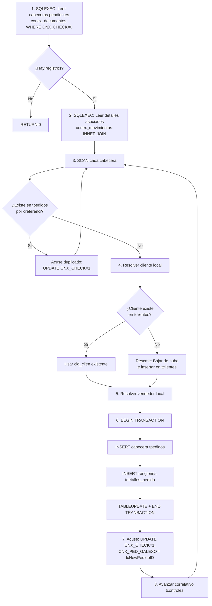

# Reglas de Negocio y Arquitectura de Sincronización

> Documento técnico de referencia — Proyecto Sincronizador Galepso  
> Última actualización: 2026-09-22  
> Basado en el análisis del código fuente actual de [`sincronizar.prg`](file:///c:/GalepsoSync/sincronizar.prg), [`clientes.prg`](file:///c:/GalepsoSync/prg/clientes.prg), [`pedidos.prg`](file:///c:/GalepsoSync/prg/pedidos.prg), [`clientes_bajada.prg`](file:///c:/GalepsoSync/prg/clientes_bajada.prg), [`config.fpw`](file:///c:/GalepsoSync/config.fpw) y [`main.py`](file:///c:/GalepsoSync/main.py).

---

## Tabla de Contenidos

1. [Arquitectura de Ejecución (Modo Sigiloso)](#1-arquitectura-de-ejecución-modo-sigiloso)
2. [Comunicación de Errores Silenciosa](#2-comunicación-de-errores-silenciosa)
3. [Reglas de Sincronización de Clientes (Bidireccional)](#3-reglas-de-sincronización-de-clientes-bidireccional)
4. [Prevención de Errores de Casteo (El Caso 00000)](#4-prevención-de-errores-de-casteo-el-caso-00000)
5. [Conflicto Estructural de Base de Datos (CRÍTICO)](#5-conflicto-estructural-de-base-de-datos-crítico)
6. [Reglas de Sincronización de Pedidos (Bajada Transaccional)](#6-reglas-de-sincronización-de-pedidos-bajada-transaccional)

---

## 1. Arquitectura de Ejecución (Modo Sigiloso)

El motor [`sincronizar.prg`](file:///c:/GalepsoSync/sincronizar.prg) está diseñado para ejecutarse **100% en segundo plano**, sin interacción humana. Esto se logra mediante tres capas coordinadas:

### 1.1 Capa 1: `config.fpw` (Nivel de Runtime VFP)

```
SCREEN=OFF
ALLOWEXTERNAL=ON
```

| Directiva | Efecto |
|---|---|
| `SCREEN=OFF` | Impide que VFP 9 cree la ventana `_SCREEN` principal. Sin esta directiva, el runtime abre una ventana GUI aunque no haya formularios, lo que bloquea la ejecución en un servicio o tarea programada. |
| `ALLOWEXTERNAL=ON` | Permite la invocación de objetos COM/ActiveX (necesario para `MSScriptControl.ScriptControl` usado en el parseo de JSON). |

> [!IMPORTANT]
> `config.fpw` debe estar en el **mismo directorio** que el ejecutable (`sincronizar.exe`) o en el directorio de trabajo actual. VFP lo lee automáticamente al arrancar.

### 1.2 Capa 2: Directivas SET en código ([sincronizar.prg:4-14](file:///c:/GalepsoSync/sincronizar.prg#L4-L14))

```foxpro
_SCREEN.Visible = .F.    && Redundancia: oculta _SCREEN aunque SCREEN=OFF falle
SYS(2335, 0)             && Desactiva cuadros de diálogo de servidor OLE de VFP
SET SAFETY OFF            && Suprime "¿Desea sobrescribir?" en COPY TO, STRTOFILE
SET TALK OFF              && Suprime eco de comandos en la barra de estado
SET NOTIFY OFF            && Suprime la barra de progreso WAIT WINDOW
SET NOTIFY CURSOR OFF     && Suprime contadores tipo "Record N of M"
SET EXCLUSIVE OFF         && Abre tablas en modo compartido por defecto
SET CPDIALOG OFF          && Suprime diálogo de página de código al abrir DBFs
SET REPROCESS TO AUTOMATIC && Reintentos automáticos de bloqueos de registro
```

Cada directiva elimina un punto potencial de bloqueo GUI. Sin ellas, un `SET SAFETY ON` puede generar un `MessageBox` nativo que congela el proceso indefinidamente.

### 1.3 Capa 3: Orquestación Python ([main.py](file:///c:/GalepsoSync/main.py))

La capa Python (`main.py`) invoca al ejecutable compilado de VFP como un **subproceso**, lo que permite:

- Control del ciclo de vida (timeout, kill)
- Lectura de logs de estado en tiempo real
- Programación de intervalos vía `config.json` → `interval_min`
- Interfaz gráfica (CustomTkinter) que muestra estado sin depender de la GUI de VFP

---

## 2. Comunicación de Errores Silenciosa

El sistema **nunca** usa `MESSAGEBOX()` ni `WAIT WINDOW` en los módulos de sincronización invocados por [`sincronizar.prg`](file:///c:/GalepsoSync/sincronizar.prg). En su lugar:

### 2.1 Escritura a archivos de log

```foxpro
* Procedimiento centralizado: EscribirLog (sincronizar.prg:217-223)
PROCEDURE EscribirLog
LPARAMETERS tcMensaje, tcArchivo
LOCAL lcMsg
lcMsg = TTOC(DATETIME()) + " - " + TRANSFORM(tcMensaje) + CHR(13) + CHR(10)
STRTOFILE(lcMsg, tcArchivo, 1)   && Flag 1 = append, nunca sobrescribe
ENDPROC
```

| Archivo | Propósito |
|---|---|
| `sync_log.txt` | Log operativo: inicio, conexión exitosa, conteos |
| `error_sync.txt` | Log de errores: fallos SQL, excepciones, registros omitidos |

### 2.2 Terminación con QUIT

Ante cualquier error irrecuperable, el flujo es:

```
Error detectado → Escribir a error_sync.txt → QUIT
```

Esto garantiza que el proceso VFP **siempre termina**, devolviendo el control a Python. Nunca se queda colgado esperando input del usuario.

### 2.3 Manejador de errores global ([sincronizar.prg:226-245](file:///c:/GalepsoSync/sincronizar.prg#L226-L245))

```foxpro
ON ERROR DO ManejadorErrores WITH ERROR(), MESSAGE(), MESSAGE(1), PROGRAM(), LINENO()
```

El procedimiento `ManejadorErrores` captura **cualquier error no anticipado por TRY/CATCH**, escribe un registro detallado en `error_sync.txt` con número de error, mensaje, programa y línea, luego cierra todo con `CLOSE DATABASES ALL`, `SQLDISCONNECT(0)` y finalmente `QUIT`.

> [!WARNING]
> El módulo [`funciones.prg`](file:///c:/GalepsoSync/prg/funciones.prg) contiene un error handler legacy (`errhand`) que usa `WAIT WINDOW` y escribe a `ERRORLOG.DBF`. Este handler **solo está activo** en el flujo interactivo de [`principal.prg`](file:///c:/GalepsoSync/prg/principal.prg) / [`sincronizar_todo.prg`](file:///c:/GalepsoSync/prg/sincronizar_todo.prg), **no** en el flujo headless de `sincronizar.prg`, que define su propio `ON ERROR`.

---

## 3. Reglas de Sincronización de Clientes (Bidireccional)

Módulo principal: [`clientes.prg`](file:///c:/GalepsoSync/prg/clientes.prg)

El flujo se ejecuta en **dos fases estrictas** dentro de la misma invocación: primero Bajada, luego Subida.

### 3.1 Bajada (Nube → Local)

**Archivo:** [`clientes.prg:44-123`](file:///c:/GalepsoSync/prg/clientes.prg#L44-L123)

#### 3.1.1 Criterio de selección de registros pendientes

```sql
SELECT cnx_clt_codigo, cnx_clt_nombre, cnx_clt_rif, cnx_clt_edo_codigo,
       cnx_clt_mpo_codigo, cnx_clt_direccion1, cnx_clt_telefono1
FROM conex_clientes
WHERE cnx_clt_check = 0
  AND (cnx_clt_galexo IS NULL OR TRIM(cnx_clt_galexo) = '')
```

Solo baja clientes que:
1. No han sido procesados (`cnx_clt_check = 0`)
2. No tienen mapeo Galepso asignado (`cnx_clt_galexo` vacío o NULL) — indica que fueron creados en la app móvil y nunca han existido en el ERP local.

#### 3.1.2 Generación del ID correlativo local

```foxpro
* Leer desde tcontroles (fuente de verdad del ERP)
lnOrigNCliente = tcontroles.NCLIENTE       && Próximo código disponible
lnMaxCid = lnOrigNCliente - 1              && Último usado

* Para cada cliente nuevo:
lnMaxCid = lnMaxCid + 1
lcNewCid = STR(lnMaxCid, 5)                && Ejemplo: "  147"
```

La generación es **secuencial estricta** basada en `tcontroles.NCLIENTE`, que funciona como autoincrement del ERP. Al finalizar:

```foxpro
REPLACE NCLIENTE WITH (lnMaxCid + 1)       && Avanza el correlativo
```

> [!IMPORTANT]
> Se usa `RLOCK()` antes de actualizar `tcontroles` para prevenir race conditions con el ERP principal.

#### 3.1.3 Mapeo estricto del identificador nube → campo local

```foxpro
lcNubeCodigo = ALLTRIM(curNubeBajada.cnx_clt_codigo)

INSERT INTO tclientes (..., cnit_cli) VALUES (..., lcNubeCodigo)
```

| Campo nube | Campo local | Rol |
|---|---|---|
| `cnx_clt_codigo` | `cnit_cli` (NIT) | **Ancla de trazabilidad**: almacena el ID original de la nube en el campo NIT del cliente local. Permite rastrear de qué registro nube proviene. |
| (generado) `lcNewCid` | `cid_clien` | ID local secuencial del ERP |

#### 3.1.4 Acuse de recibo en la nube

```foxpro
UPDATE conex_clientes
SET cnx_clt_galexo = ?lcNewCid,
    cnx_clt_check = 1
WHERE cnx_clt_codigo = ?curNubeBajada.cnx_clt_codigo
```

Devuelve el ID local generado al campo `cnx_clt_galexo` y marca `cnx_clt_check = 1` para que no se vuelva a bajar.

---

### 3.2 Subida (Local → Nube)

**Archivo:** [`clientes.prg:125-193`](file:///c:/GalepsoSync/prg/clientes.prg#L125-L193)

#### 3.2.1 Criterio de selección de registros pendientes

```foxpro
SELECT ... FROM tclientes WHERE EMPTY(cnit_cli) INTO CURSOR curSubidaLocal
```

Solo sube clientes cuyo `cnit_cli` está vacío, lo que significa que **nunca han sido sincronizados con la nube** (ni bajados de ella ni subidos previamente).

#### 3.2.2 Proceso de sanitización del código local

```foxpro
lcCidClien = ALLTRIM(STRTRAN(curSubidaLocal.cid_clien, " ", ""))
```

| Función | Propósito |
|---|---|
| `ALLTRIM()` | Elimina espacios de relleno que VFP agrega automáticamente a campos Character de ancho fijo |
| `STRTRAN(..., " ", "")` | Elimina espacios internos residuales |

> [!CAUTION]
> **NO se usa PADL con ceros**. El código viaja limpio: `"147"`, nunca `"00147"`. Esto es crítico porque el campo `cnx_clt_galexo` de MariaDB almacena esta cadena tal cual, y cualquier relleno de ceros generaría inconsistencias en los JOINs de pedidos.

#### 3.2.3 Mapeo de campos: `cnx_clt_galexo` vs `cnx_clt_codigo`

```foxpro
lcSqlInsert = "INSERT INTO conex_clientes " + ;
  "(cnx_clt_codigo, cnx_clt_galexo, cnx_clt_nombre, cnx_clt_rif, cnx_clt_edo_codigo) " + ;
  "VALUES (?lcCidClien, ?lcCidClien, ?lcNombre, ?lcRif, ?lnEdoCodigo) " + ;
  "ON DUPLICATE KEY UPDATE " + ;
  "cnx_clt_galexo = VALUES(cnx_clt_galexo), ..."
```

| Campo MariaDB | Valor enviado | Semántica de negocio |
|---|---|---|
| `cnx_clt_codigo` | `lcCidClien` (ej: `"147"`) | **Código dinámico/editable.** Es el identificador actual del cliente. Puede mutar si el ERP lo renumera (ej: fusión de cuentas). |
| `cnx_clt_galexo` | `lcCidClien` (mismo valor en INSERT inicial) | **Ancla inmutable.** Una vez asignado, jamás debe cambiar. Es el "Galepso ID" que identifica históricamente al cliente en la nube. Todos los pedidos, CxC y documentos referencian este valor. |

#### 3.2.4 Lógica del `ON DUPLICATE KEY UPDATE`

La cláusula `ON DUPLICATE KEY UPDATE` depende de **qué campo tiene la restricción UNIQUE** en MariaDB. La intención del código es:

1. Si el `cnx_clt_galexo` ya existe → **actualizar** `cnx_clt_codigo`, nombre, RIF, etc.
2. Si no existe → **insertar** nuevo registro.

Para que esto funcione correctamente, **la restricción UNIQUE debe estar en `cnx_clt_galexo`**, no en `cnx_clt_codigo`. Véase [Sección 5](#5-conflicto-estructural-de-base-de-datos-crítico).

#### 3.2.5 Marca post-subida

```foxpro
UPDATE tclientes SET cnit_cli = curSubidaLocal.cid_clien
WHERE cid_clien = curSubidaLocal.cid_clien
```

Después de una subida exitosa, escribe el propio `cid_clien` en `cnit_cli`. Esto cumple dos funciones:
1. Marca el registro como "ya sincronizado" (`EMPTY(cnit_cli)` será `.F.`)
2. Mantiene la referencia cruzada para la lógica de pedidos

---

## 4. Prevención de Errores de Casteo (El Caso 00000)

### 4.1 El problema

Cuando VFP lee un campo numérico de MariaDB mediante `SQLEXEC`, el resultado puede llegar como tipo `Numeric` o como `Character` dependiendo de la definición del campo remoto, del driver ODBC, y de la versión del cursor. Al hacer:

```foxpro
* PELIGROSO:
lcCodigo = STR(cur_nube.cnx_clt_codigo, 5)   && Si el valor es "147" (char), VAL devuelve 0
                                               && STR(0, 5) = "    0" → PADL = "00000"
```

Un campo `VARCHAR` leído con `STR()` o `PADL(VAL(...))` puede colapsar a `0` si la conversión numérica falla, generando IDs de cliente/pedido como `"00000"` o `"    0"`.

### 4.2 La solución implementada: lectura agnóstica con `ALLTRIM(TRANSFORM())`

```foxpro
* SEGURO (usado en clientes.prg y pedidos.prg):
lcNubeCodigo = ALLTRIM(TRANSFORM(cur_conex_doc.CNX_DCL_NUMERO))
lcCloudCli   = ALLTRIM(TRANSFORM(cur_conex_doc.cnx_dcl_clt_codigo))
```

| Función | Efecto |
|---|---|
| `TRANSFORM()` | Convierte cualquier tipo (N, C, L, D) a Character sin pérdida. Un numérico `147` se convierte en `"147"`, un char `"147"` se queda como `"147"`. |
| `ALLTRIM()` | Elimina espacios de relleno |

Esta combinación es **agnóstica al tipo** y nunca produce `"00000"`. 

### 4.3 Donde aplica

- [`clientes.prg:79`](file:///c:/GalepsoSync/prg/clientes.prg#L79): lectura de `cnx_clt_codigo` en bajada
- [`clientes.prg:149`](file:///c:/GalepsoSync/prg/clientes.prg#L149): sanitización de `cid_clien` en subida  
- [`pedidos.prg:146`](file:///c:/GalepsoSync/prg/pedidos.prg#L146): lectura de `CNX_DCL_NUMERO` (número de pedido nube)
- [`pedidos.prg:170-171`](file:///c:/GalepsoSync/prg/pedidos.prg#L170-L171): lectura de `cnx_dcl_clt_codigo` y `cnx_dcl_ven_codigo`
- [`pedidos.prg:197`](file:///c:/GalepsoSync/prg/pedidos.prg#L197): lectura de `CNX_CLT_GALEXO` con `NVL` adicional

> [!TIP]
> **Regla universal para el proyecto:** Nunca usar `VAL()` + `STR()` para leer IDs que vienen de MariaDB. Siempre usar `ALLTRIM(TRANSFORM(campo))`.

---

## 5. Conflicto Estructural de Base de Datos (CRÍTICO)

> [!CAUTION]
> Esta sección documenta un **defecto estructural activo** en la base de datos de producción que impide que la arquitectura de sincronización bidireccional funcione correctamente.

### 5.1 Estado actual de la tabla `conex_clientes` en MariaDB

```
╔═══════════════════╦══════════════════════╦════════════════════╗
║ Campo             ║ Restricción actual   ║ Rol de negocio     ║
╠═══════════════════╬══════════════════════╬════════════════════╣
║ CNX_CLT_CODIGO    ║ PRIMARY KEY ✓        ║ Código editable    ║
║ CNX_CLT_GALEXO    ║ (sin índice único)   ║ Ancla inmutable    ║
╚═══════════════════╩══════════════════════╩════════════════════╝
```

### 5.2 El conflicto

La cláusula `ON DUPLICATE KEY UPDATE` de MariaDB/MySQL evalúa unicidad **solamente** contra columnas con restricciones `PRIMARY KEY` o `UNIQUE KEY`. Con la estructura actual:

```sql
INSERT INTO conex_clientes (cnx_clt_codigo, cnx_clt_galexo, ...) 
VALUES ('147', '147', ...)
ON DUPLICATE KEY UPDATE
    cnx_clt_galexo = VALUES(cnx_clt_galexo), ...
```

**Lo que sucede con la PK en `cnx_clt_codigo`:**

| Escenario | Resultado | ¿Correcto? |
|---|---|---|
| Primera subida: `codigo=147`, `galexo=147` | INSERT nuevo registro | ✅ |
| Re-sync sin cambios: `codigo=147`, `galexo=147` | UPDATE (PK duplicada detectada) | ✅ |
| ERP renumera al cliente: `codigo=200`, `galexo=147` | INSERT **nuevo registro** (PK `200` no existe) | ❌ **DUPLICADO** |

**El problema:** Si el ERP cambia el `cid_clien` de un cliente (renumeración, fusión), el `cnx_clt_codigo` cambia pero `cnx_clt_galexo` no. Con la PK en `cnx_clt_codigo`, el `ON DUPLICATE KEY` **no detecta la duplicación** porque evalúa contra `codigo=200` (que no existe), generando un segundo registro en lugar de actualizar el existente.

### 5.3 Segundo efecto: inconsistencia de JOINs

Los pedidos (`conex_documentos`) referencian clientes por `cnx_dcl_clt_codigo`. Si existe un duplicado con dos `cnx_clt_codigo` distintos para el mismo `cnx_clt_galexo`, los JOINs se rompen o devuelven el registro equivocado.

### 5.4 Recomendación técnica: Instrucciones SQL para el DBA

> [!IMPORTANT]
> Las siguientes sentencias deben ejecutarse en la base de datos **`bdsistemas2`** de MariaDB, conectándose desde DBeaver o un cliente equivalente. **Realizar un backup completo antes de ejecutar.**

#### Paso 1: Verificar el estado actual

```sql
-- Verificar la estructura actual de la tabla
SHOW CREATE TABLE conex_clientes;

-- Verificar si hay duplicados en cnx_clt_galexo que impedirían crear el UNIQUE
SELECT cnx_clt_galexo, COUNT(*) AS qty
FROM conex_clientes
WHERE cnx_clt_galexo IS NOT NULL AND TRIM(cnx_clt_galexo) <> ''
GROUP BY cnx_clt_galexo
HAVING COUNT(*) > 1;
```

> [!WARNING]
> Si la consulta de duplicados devuelve resultados, se deben **resolver manualmente** antes de continuar (eliminar o fusionar los duplicados).

#### Paso 2: Eliminar la llave primaria actual

```sql
ALTER TABLE conex_clientes DROP PRIMARY KEY;
```

#### Paso 3: Agregar `cnx_clt_codigo` como AUTO_INCREMENT con índice (no PK)

```sql
-- Si cnx_clt_codigo es numérico y se necesita como autoincrement:
ALTER TABLE conex_clientes 
    MODIFY cnx_clt_codigo INT NOT NULL AUTO_INCREMENT,
    ADD INDEX idx_cnx_clt_codigo (cnx_clt_codigo);

-- Si cnx_clt_codigo es VARCHAR y no necesita autoincrement:
ALTER TABLE conex_clientes 
    ADD INDEX idx_cnx_clt_codigo (cnx_clt_codigo);
```

#### Paso 4: Crear el UNIQUE KEY en `cnx_clt_galexo`

```sql
ALTER TABLE conex_clientes 
    ADD UNIQUE KEY uk_cnx_clt_galexo (cnx_clt_galexo);
```

#### Paso 5: Verificar la nueva estructura

```sql
SHOW CREATE TABLE conex_clientes;
```

#### Resultado esperado

```
╔═══════════════════╦══════════════════════╦════════════════════╗
║ Campo             ║ Restricción nueva    ║ Rol de negocio     ║
╠═══════════════════╬══════════════════════╬════════════════════╣
║ CNX_CLT_CODIGO    ║ INDEX (no único)     ║ Código editable    ║
║ CNX_CLT_GALEXO    ║ UNIQUE KEY ✓         ║ Ancla inmutable    ║
╚═══════════════════╩══════════════════════╩════════════════════╝
```

Con esta estructura, el `ON DUPLICATE KEY UPDATE` evaluará contra `cnx_clt_galexo`, que es el ancla correcta. Si el ERP renumera un cliente de `147` a `200`:

```sql
INSERT INTO conex_clientes (cnx_clt_codigo, cnx_clt_galexo, ...) 
VALUES ('200', '147', ...)
ON DUPLICATE KEY UPDATE
    cnx_clt_codigo = VALUES(cnx_clt_codigo), ...
-- ^ Detecta que galexo='147' ya existe → UPDATE correcto
```

---

## 6. Reglas de Sincronización de Pedidos (Bajada Transaccional)

Módulo: [`pedidos.prg`](file:///c:/GalepsoSync/prg/pedidos.prg) — **Patrón C: Bajada Transaccional ACID**

### 6.1 Flujo general



### 6.2 Verificación preventiva de duplicados

```foxpro
LOCATE FOR ALLTRIM(creferenci) == lcNumeroNube
IF FOUND()
    * Ya existe → solo marcar en nube y continuar
    SQLEXEC(tnH, "UPDATE conex_documentos SET CNX_CHECK=1, CNX_PED_GALEXO=?lcNewPedidoID ...")
    LOOP
ENDIF
```

Esto protege contra el escenario donde un pedido se insertó correctamente en VFP pero el acuse a MariaDB falló (desconexión, timeout). Sin esta verificación, el pedido se duplicaría al reintentar.

### 6.3 Rescate de entidades faltantes (Cliente / Vendedor)

Si el cliente o vendedor del pedido no existe localmente, [`pedidos.prg`](file:///c:/GalepsoSync/prg/pedidos.prg) ejecuta un **rescate inline**:

1. Consulta la nube para obtener los datos completos del cliente/vendedor
2. Verifica si tiene `cnx_clt_galexo` asignado (ya sincronizado antes)
3. Si tiene galexo → usa ese ID con PADL de 5 posiciones
4. Si no tiene galexo → autogenera correlativo con `MAX(VAL(cid_clien)) + 1`
5. Inserta en `tclientes` con el mapeo cruzado: `cnit_cli = lcCloudCli`

### 6.4 Transaccionalidad ACID

```foxpro
BEGIN TRANSACTION
    INSERT INTO tpedidos ...
    INSERT INTO tdetalles_pedido ... (N renglones)
    TABLEUPDATE(1, .T., "tpedidos")
    TABLEUPDATE(1, .T., "tdetalles_pedido")
END TRANSACTION
FLUSH FORCE
```

Si cualquier paso falla:

```foxpro
ROLLBACK
TABLEREVERT(.T., "tpedidos")
TABLEREVERT(.T., "tdetalles_pedido")
```

### 6.5 Saneamiento preventivo de transacciones huérfanas

```foxpro
* Al inicio del módulo (pedidos.prg:29-31)
DO WHILE TXNLEVEL() > 0
    ROLLBACK
ENDDO
```

Esto limpia cualquier transacción abierta por una ejecución anterior que terminó abruptamente, evitando que un `BEGIN TRANSACTION` posterior lance un error de anidamiento.

### 6.6 Mapeo de campos cabecera

| Campo nube (`conex_documentos`) | Campo local (`tpedidos`) | Notas |
|---|---|---|
| `CNX_DCL_NUMERO` | `creferenci` | Referencia cruzada (trazabilidad) |
| (generado) `lcNewPedidoID` | `cid_pedido` | Correlativo local vía `tcontroles.npedidos_c` |
| `cnx_dcl_clt_codigo` | `cid_clien` | Resuelto vía lookup/rescate |
| `cnx_dcl_ven_codigo` | `cid_vende` | Resuelto vía lookup/rescate |
| `CNX_DCL_NETO` | `nmonto_t` | Monto total |

### 6.7 Acuse de recibo y avance de correlativo

```foxpro
* Solo después de END TRANSACTION exitoso:
SQLEXEC(tnH, "UPDATE conex_documentos SET CNX_CHECK=1, CNX_PED_GALEXO=?lcNewPedidoID WHERE CNX_DCL_NUMERO=?lcNumeroNube")

SELECT tcontroles
REPLACE npedidos_c WITH (lnNextPedido + 1)
UNLOCK
```

El acuse se hace **después** de la transacción local exitosa. Si el acuse a MariaDB falla, la verificación de duplicados (sección 6.2) lo resolverá en la siguiente ejecución.

---

## Apéndice A: Resumen de flujos de datos

```
┌──────────────────┐        SUBIDA (Local→Nube)        ┌──────────────────┐
│   VFP Local      │ ──────────────────────────────────→│   MariaDB Nube   │
│                  │  Clientes: ON DUPLICATE KEY UPDATE │                  │
│  tclientes       │  Vendedores: REPLACE INTO          │  conex_clientes  │
│  tvendedores     │                                    │  conex_vendedores│
│                  │                                    │                  │
│  tpedidos        │        BAJADA (Nube→Local)         │  conex_documentos│
│  tdetalles_pedido│ ←─────────────────────────────────│  conex_movimientos│
│  tclientes       │  Pedidos: BEGIN/END TRANSACTION    │  conex_clientes  │
│                  │  Clientes: INSERT + acuse          │                  │
└──────────────────┘                                    └──────────────────┘
```

## Apéndice B: Dos motores de sincronización coexistentes

> [!NOTE]
> El proyecto mantiene **dos motores** de sincronización en paralelo:
>
> | Motor | Entry Point | Invocado por | Modo |
> |---|---|---|---|
> | **Headless** | [`sincronizar.prg`](file:///c:/GalepsoSync/sincronizar.prg) | Python (`main.py`) vía `subprocess` | Sigiloso, lee `config.json`, termina con `QUIT` |
> | **Interactivo** | [`sincronizar_todo.prg`](file:///c:/GalepsoSync/prg/sincronizar_todo.prg) → [`principal.prg`](file:///c:/GalepsoSync/prg/principal.prg) | Formulario VFP (`frmrespaldos`) | GUI, usa `MESSAGEBOX`, variables `PUBLIC` |
>
> Ambos invocan los mismos módulos hijo (`clientes.prg`, `pedidos.prg`), pero con distintas convenciones de reporte de error. Los módulos hijo deben ser compatibles con ambos motores.
